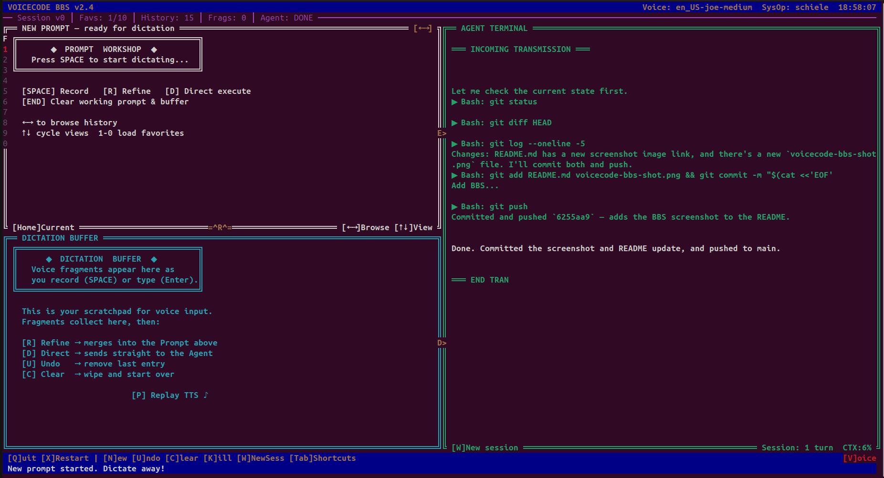

```
██╗   ██╗ ██████╗ ██╗ ██████╗███████╗ ██████╗ ██████╗ ██████╗ ███████╗
██║   ██║██╔═══██╗██║██╔════╝██╔════╝██╔════╝██╔═══██╗██╔══██╗██╔════╝
██║   ██║██║   ██║██║██║     █████╗  ██║     ██║   ██║██║  ██║█████╗
╚██╗ ██╔╝██║   ██║██║██║     ██╔══╝  ██║     ██║   ██║██║  ██║██╔══╝
 ╚████╔╝ ╚██████╔╝██║╚██████╗███████╗╚██████╗╚██████╔╝██████╔╝███████╗
  ╚═══╝   ╚═════╝ ╚═╝ ╚═════╝╚══════╝ ╚═════╝ ╚═════╝ ╚═════╝ ╚══════╝
```

# VoiceCode BBS

> *"GREETINGS PROFESSOR FALKEN."*
>
> A retro BBS-style voice-driven prompt workshop for AI agents (Claude, Gemini).
> Dictate prompts, refine them with AI, and execute them in a novel dictation and refinement workflow that builds its own prompt history.

**Supports Claude CLI and Gemini CLI.**



---

## Quick Start

### Prerequisites

- **Python 3.12+**
- **Linux** with ALSA (for TTS playback via `aplay`)
- A working **microphone**
- [**Claude CLI**](https://docs.anthropic.com/en/docs/claude-cli) and/or [**Gemini CLI**](https://github.com/google-gemini/gemini-cli) installed and authenticated

### Install

```bash
git clone https://github.com/shazbot996/voicecode-bbs.git
cd voicecode-bbs

# Automated setup (checks system deps, creates venv, installs everything)
make init

# Or manually:
python -m venv venv
source venv/bin/activate
pip install torch --index-url https://download.pytorch.org/whl/cpu
pip install -r requirements.txt
```

System dependencies (installed via your package manager):
- `libportaudio2` — audio capture
- `alsa-utils` — TTS playback (`aplay`)

### Run

# invoke via make, or do it yourself
make voicecode

```bash
source venv/bin/activate
python voicecode_bbs.py
```

# I added an extra:
make init-sub 

This app is intended to live as a subfolder in an existing deployment. To make sure your code assist apps always invoke from the root of your repo, I added 'make init-sub' that just creates a makefile in the root of your repo that will invoke this app from the root of your repo - or adds this command to it if one already exists. Then just run 'make voicecode' from the root, and you can use voicecode to build prompts for your other code assist apps. 


Whisper model size and prompt library path are configurable via the in-app settings menu (**O** key).

---

## What Is This?

VoiceCode is a voice-first CLI for working with AI agents. I built it after many iterations with code assist cli tools, vs code, and various prompt editors. Once an AI developer starts getting more structural with code generating, there is still an extremely distilled need to write as much of your own context as possible to focus the builds and control as much as possible. In other words, typing boatloads of long form prompts by hand, and it takes a lot of time. If you are short-cutting this, then you aren't really controlling what you are making.

So I built an voice dictation system that I vibe coded with and refined until I really feel like it has a workflow that speeds me up, and improves my capture of historical context. It's a great context generator for a prompt library!

This is not a general-purpose dictation tool. It is purpose-built for the prompt engineering workflow: you dictate fragments of what you want, refine them into a structured prompt with AI assistance, then execute that prompt against an agent. Prompt histories are preserved so you can browse and re-execute previous work. The trick is the fluidity with how you can build a prompt by combining your voice dictation, hand direct editing, copy/paste integration, and an interactive "string injector" that can paste critcial syntax strings from your project into your prompt with a single keystroke. 

The interface is a full curses TUI styled after 1990s bulletin board systems with all the retro charm you remember (or wish you did). Yeah I'm an old head and I feel all warm and cozy in a curses UI.  But it's all keyboard shortcuts and fairly fast workflow. 

This application is intended to be deployed into a given deployment or monorepo in a folder alongside your build.  It has a Makefile that will help you figure out how to launch it. Ideally, launch it from the root of your repo by just running

---

## The Workflow

```
  1. DICTATE         2. REFINE           3. EXECUTE          4. LISTEN
 ┌──────────┐     ┌──────────┐       ┌──────────┐       ┌──────────┐
 │  Speak   │     │ AI turns │       │  Prompt  │       │ Response │
 │  your    │ ──► │ fragments│  ──►  │  sent to │  ──►  │ streamed │
 │  ideas   │     │ into a   │       │  Claude  │       │ back w/  │
 │          │     │ prompt   │       │  CLI     │       │ TTS      │
 └──────────┘     └──────────┘       └──────────┘       └──────────┘
    [SPACE]           [R]                [E]                [P]
```

1. **Dictate** — Press SPACE to record. Speak naturally; fragments accumulate in the buffer. Start and stop repeatedly. Undo mistakes. 
2. **Refine** — Press R to have AI synthesize your fragments into a polished prompt.
3. **Execute** — Press E to send the prompt to Claude. Watch the ZMODEM animation, then the response streams in with a typewriter effect.
4. **Listen** — The agent's TTS summary is read aloud. Press P to replay.

Or press **D** to skip refinement and send raw dictation directly.

---

## Three-Pane Layout


- **Prompt Browser** (top-left) — View and browse your refined prompts. History entries show both the prompt and agent response in a combined scrollable view. Favorites indicators on the left border.
- **Dictation Buffer** (bottom-left) — Watch voice fragments accumulate in real-time.
- **Agent Terminal** (right) — ZMODEM transfer animation, then typewriter-streamed responses with context meter.

---

## Keyboard Controls

| Key | Action |
|:---:|--------|
| `SPACE` | Toggle recording |
| `R` | Refine fragments into a prompt |
| `D` | Direct execute (skip refinement) |
| `E` | Execute current prompt |
| `F` | Assign prompt to favorites slot (1-10) |
| `1`-`9`, `0` | Quick-load favorites 1-10 |
| `N` | New prompt (clear buffer, keep session) |
| `U` | Undo last dictation entry |
| `C` | Clear dictation buffer |
| `Enter` | Type text directly into dictation buffer |
| `Tab` | Shortcuts browser (inject paths/strings; works mid-recording) |
| `←` `→` | Browse prompt history |
| `↑` `↓` | Cycle active/favorites views |
| `Home` | Return to current prompt |
| `PgUp` `PgDn` | Scroll prompt browser (history) or agent terminal |
| `O` | Settings / voice configuration |
| `W` | New session (clear conversation context) |
| `ESC` | Voice command mode |
| `K` | Kill running agent |
| `P` | Replay TTS summary |
| `H` | Help overlay |
| `A` | About / title screen |
| `X` | Restart application |
| `Q` | Quit |

---

## Features

### Voice Commands

Press **ESC** to enter voice command mode — then speak any action:

> *"record"* · *"refine"* · *"execute"* · *"next"* · *"previous"* · *"settings"* · *"quit"*

Every keyboard action has a voice equivalent. Go fully hands-free.

### Audio Pipeline

```
Microphone (16kHz mono)
       │
       ▼
   30ms blocks (480 samples)
       │
       ▼
   Silero VAD ──── silence? ──── skip
       │
     speech
       │
       ▼
   faster-whisper STT (int8)
       │
       ▼
   Dictation Buffer / CLI
```

- **Silero VAD** detects speech vs. silence in real-time
- **faster-whisper** transcribes speech locally (no cloud API) with int8 quantization
- **Piper TTS** provides local text-to-speech output with multiple voice options
- Models are **lazy-loaded** on first use — startup takes ~1 second

### Prompt History & Response Archive

Every executed prompt is saved as a paired set of files — the prompt and its agent response:

```
~/prompts/voicecode/history/
  ├── 001_binary_search_function_prompt.md
  ├── 001_binary_search_function_response.md
  ├── 002_refactor_auth_middleware_prompt.md
  ├── 002_refactor_auth_middleware_response.md
  └── 003_add_unit_tests_prompt.md
```

When browsing history with **Left/Right** arrows, the Prompt Browser shows both the original prompt and the agent's response in a combined view with ASCII section headers. Use **PgUp/PgDn** to scroll through long entries. Use **Up/Down** to toggle between active and favorites views.

### 10-Slot Favorites

Press **F** to assign a prompt to one of 10 numbered favorites slots (keys 1-9 and 0). Quick-load any favorite by pressing its number. Favorites indicators on the Prompt Browser border show which slots are filled.

### Session Continuity

Each session gets an ID passed to Claude via `--resume`, so conversation context carries across multiple execute cycles. Press **W** to start a fresh session. The context meter on the agent terminal border shows how much of Claude's context window has been used.

### Shortcuts Browser

Press **Tab** to open the shortcuts browser — a navigable overlay for injecting paths, strings, or project folders into the dictation buffer. This works **mid-recording**: the shortcut is timestamped and merged into the final transcript at the correct position using Whisper's word-level timestamps.

### Configuration

Settings are persisted to `~/.config/voicecode/settings.json` and can be changed in-app via the **O** key:

- Whisper model size (tiny.en, base.en, small.en, medium.en)
- VAD sensitivity threshold
- Silence timeout duration
- Minimum speech duration
- TTS voice selection
- TTS volume gain
- Prompt library path
- Working directory for shortcuts browser

---

## Tech Stack

| Component | Technology |
|-----------|-----------|
| Language | Python 3.12 |
| Speech-to-Text | [faster-whisper](https://github.com/SYSTRAN/faster-whisper) (tiny.en / base.en / small.en / medium.en) |
| Voice Activity Detection | [Silero VAD](https://github.com/snakers4/silero-vad) + PyTorch (CPU-only) |
| Text-to-Speech | [Piper TTS](https://github.com/rhasspy/piper) |
| Audio Capture | sounddevice + NumPy |
| Terminal UI | Python curses |
| AI Backend | Claude CLI, Gemini CLI |

---

## Agent Support

**Supported agents:**
- **Claude CLI** (`claude` command)
- **Gemini CLI** (`gemini` command)

---

<p align="center">
  <code>Protocol: ZMODEM-VOICE/1.0 · Connection: LOCAL · BPS: 115200</code>
</p>
